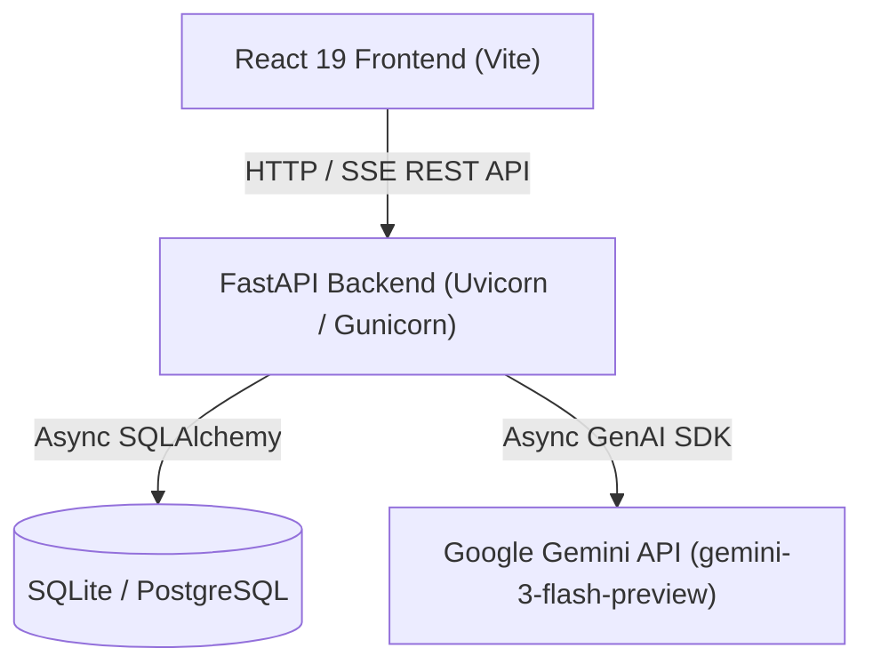

# AI Interview Preparation Chatbot

Full-stack mock technical interview web application with automated Gemini AI evaluation and session performance report generation.

<!-- NEEDS INPUT: CI status badge - No CI pipeline config found in repository -->
<!-- NEEDS INPUT: License badge - No LICENSE file present in repository -->

## Table of Contents

- [Overview](#overview)
- [Architecture](#architecture)
- [Features](#features)
- [Tech Stack](#tech-stack)
- [Prerequisites](#prerequisites)
- [Installation](#installation)
- [Configuration](#configuration)
- [Usage](#usage)
- [Project Structure](#project-structure)
- [Testing & Verification](#testing--verification)
- [Deployment](#deployment)
- [Contributing](#contributing)
- [License](#license)

---

## Overview

The AI Interview Preparation Chatbot allows job candidates to practice technical interviews across different domains, languages, and difficulty levels. Candidates answer questions via text or code input, receive incremental hints, and obtain immediate score breakdowns for correctness, completeness, and clarity. At the end of each session, the application generates a comprehensive evaluation report downloadable as a PDF.

---

## Architecture



---

## Features

- **User Authentication**: Secure user registration and login using JWT bearer tokens (`PyJWT`) and password hashing (`bcrypt`).
- **Configurable Interview Setup**: Select domain, programming language, and difficulty level (Beginner, Intermediate, Advanced).
- **Interactive Chat Interface**: Dual input modes supporting standard text and code editing powered by Monaco Editor (`@monaco-editor/react`).
- **Real-Time Evaluation Streaming**: Server-Sent Events (`text/event-stream`) deliver real-time feedback and upcoming questions.
- **Progressive Hinting**: System provides up to 3 escalating hints per question with automated scoring deductions.
- **Time Penalty Tracking**: Automatically flags and penalizes answers taking longer than 5 minutes (300 seconds).
- **Session History & Analytics**: Tracks user performance across multiple interview sessions.
- **PDF Report Generation**: Renders final evaluation summary with score breakdowns downloadable as PDF using `html2pdf.js`.
- **Mock AI Mode**: Gracefully falls back to structured mock questions and feedback when `GEMINI_API_KEY` is not provided.
- **API Rate Limiting**: Endpoint protection implemented using `slowapi`.

---

## Tech Stack

### Backend

- **Language**: Python 3.11+
- **Framework**: FastAPI `>=0.110.0`
- **ASGI Server**: Uvicorn `[standard]>=0.29.0`, Gunicorn `>=22.0.0`
- **Database / ORM**: SQLAlchemy `>=2.0.29` (Async), `asyncpg>=0.29.0` (PostgreSQL), `aiosqlite>=0.20.0` (SQLite)
- **AI Integration**: `google-genai>=0.3.0` (`gemini-3-flash-preview`)
- **Authentication**: PyJWT `>=2.8.0`, `bcrypt>=4.1.2`
- **Security & Utilities**: `slowapi>=0.1.9` (Rate limiting), `json-repair>=0.23.0`, `python-dotenv>=1.0.1`

### Frontend

- **Language**: JavaScript (ES Modules)
- **Framework**: React `^19.2.5`
- **Build Tool**: Vite `^8.0.10`
- **Code Editor**: `@monaco-editor/react` `^4.7.0`
- **Markdown Rendering**: `react-markdown` `^10.1.0`
- **Icons**: `lucide-react` `^1.9.0`
- **HTTP Client**: Axios `^1.15.2`
- **PDF Export**: `html2pdf.js` `^0.14.0`
- **Linter**: ESLint `^10.2.1`

---

## Prerequisites

- **Python**: Version `3.11` or newer (3.11.9 recommended as specified in [backend/.python-version](file:///backend/.python-version)).
- **Node.js**: Version `18.0` or newer.
- **npm**: Package manager included with Node.js.
- **Google Gemini API Key**: (Optional) Required for live AI generation. If omitted, the application operates in mock mode.

---

## Installation

### 1. Clone the repository

```bash
git clone https://github.com/Omiiii04/AI_Mini_Project.git
cd AI_Mini_Project
```

### 2. Set up the backend

```bash
cd backend
python -m venv venv
```

Activate the virtual environment:

- **Windows PowerShell**:
  ```powershell
  .\venv\Scripts\Activate.ps1
  ```
- **macOS / Linux**:
  ```bash
  source venv/bin/activate
  ```

Install dependencies:

```bash
pip install -r requirements.txt
```

> **Note**: To modify dependencies, edit [backend/requirements.in](file:///backend/requirements.in) and recompile using `uv`:
> ```bash
> uv pip compile backend/requirements.in --python-version 3.11 --universal --generate-hashes --no-emit-index-url --output-file backend/requirements.txt
> ```

### 3. Set up the frontend

Open a new terminal window:

```bash
cd frontend
npm install
```

---

## Configuration

### Backend Environment Variables

Copy the example environment file inside the [backend](file:///backend) directory:

- **Windows PowerShell**:
  ```powershell
  Copy-Item .env.example .env
  ```
- **macOS / Linux**:
  ```bash
  cp .env.example .env
  ```

Configure the parameters in `backend/.env`:

| Variable | Required | Default | Description |
| :--- | :---: | :--- | :--- |
| `JWT_SECRET_KEY` | **Yes** | None | Secret key used for signing JWT authentication tokens. The app will fail to start if this is missing. |
| `GEMINI_API_KEY` | No | None | Google Gemini API key. If omitted, mock questions and evaluations are returned. |
| `DATABASE_URL` | No | `sqlite+aiosqlite:///./interview.db` | Async SQLAlchemy database URL. Accepts SQLite or PostgreSQL (`postgresql+asyncpg://...`). |
| `ALLOWED_ORIGINS` | No | `http://localhost:80,http://localhost:5173,...` | Comma-separated list of CORS origins allowed to access the backend API. |

### Frontend Environment Variables

Create `frontend/.env` (optional):

| Variable | Required | Default | Description |
| :--- | :---: | :--- | :--- |
| `VITE_API_URL` | No | `http://127.0.0.1:8000` | Backend API base URL used by Axios and EventSource requests. |

---

## Usage

### Running the Backend Server

Ensure your Python virtual environment is activated, then run:

```bash
cd backend
uvicorn app.main:app --reload
```

The FastAPI backend starts at `http://127.0.0.1:8000`.
Interactive OpenAPI documentation is available at `http://127.0.0.1:8000/docs`.

### Running the Frontend Server

In a separate terminal, start the Vite development server:

```bash
cd frontend
npm run dev
```

Access the web application at `http://localhost:5173`.

### End-to-End Workflow

1. Navigate to `http://localhost:5173` and register a new account on the Auth screen.
2. Select an interview domain (e.g., Data Structures & Algorithms, DBMS), programming language, and difficulty level.
3. Complete the interview by responding to questions via text or code.
4. Request hints when stuck or finish the session to generate the performance dashboard.
5. Download the session report as a PDF.

---

## Project Structure

```text
AI_Mini_Project/
├── backend/
│   ├── app/
│   │   ├── api/          # FastAPI authentication, dependency injection, and session routes
│   │   ├── core/         # Database connection, security JWT, logger, and rate limiter
│   │   ├── models/       # SQLAlchemy database tables (UserDB, SessionDB, MessageDB)
│   │   ├── schemas/      # Pydantic request/response schemas
│   │   └── services/     # Gemini API integration and fallback mock generator logic
│   │   └── main.py       # ASGI entry point, lifespan table creation, and middleware
│   ├── .env.example      # Sample backend environment configuration
│   ├── .python-version   # Recommended Python runtime version (3.11.9)
│   ├── requirements.in   # Unpinned top-level dependency declarations
│   └── requirements.txt  # Pinned dependency lockfile with package hashes
├── frontend/
│   ├── public/           # Static asset files
│   ├── src/
│   │   ├── components/   # UI views split into chat, layout, setup, and summary modules
│   │   ├── hooks/        # Interview state management and SSE response handler hook
│   │   ├── services/     # Axios client configuration and authentication interceptor
│   │   ├── styles/       # Application stylesheet definitions
│   │   ├── App.jsx       # Root React component managing navigation state
│   │   └── main.jsx      # React DOM entry point
│   ├── package.json      # Frontend package manifest and script declarations
│   ├── package-lock.json # Locked frontend dependency tree
│   └── vite.config.js    # Vite build and plugin configuration
└── README.md
```

---

## Testing & Verification

### Frontend Verification

Run ESLint to check for syntax and code formatting issues:

```bash
cd frontend
npm run lint
```

Build the production frontend assets:

```bash
cd frontend
npm run build
```

### Backend Verification

Ensure all dependencies are installed and test importing the main module:

```bash
cd backend
python -c "import app.main; print('Backend loaded successfully')"
```

> **Note**: Automated unit testing frameworks (e.g., `pytest` or `vitest`) are not currently configured in this repository.

---

## Deployment

### Backend Deployment

The database module in [backend/app/core/db.py](file:///backend/app/core/db.py#L12-L16) includes logic to enable `ssl=require` when connected to non-SQLite database URLs (such as Render PostgreSQL).

To start a production server using Gunicorn:

```bash
cd backend
gunicorn app.main:app -w 4 -k uvicorn.workers.UvicornWorker -b 0.0.0.0:8000
```

### Frontend Deployment

Build production static assets using Vite:

```bash
cd frontend
npm run build
```

The compiled output will be generated in `frontend/dist/` and can be served via Nginx, Vercel, Netlify, or static web host.

---

## Contributing

Contributions are welcome. Please ensure that all modified files pass the frontend linter (`npm run lint`) and that backend imports initialize without missing environment dependencies.

---

## License

<!-- NEEDS INPUT: License type and LICENSE file missing in repository -->
This project does not currently contain an explicit `LICENSE` file. All rights reserved by the project owners.
