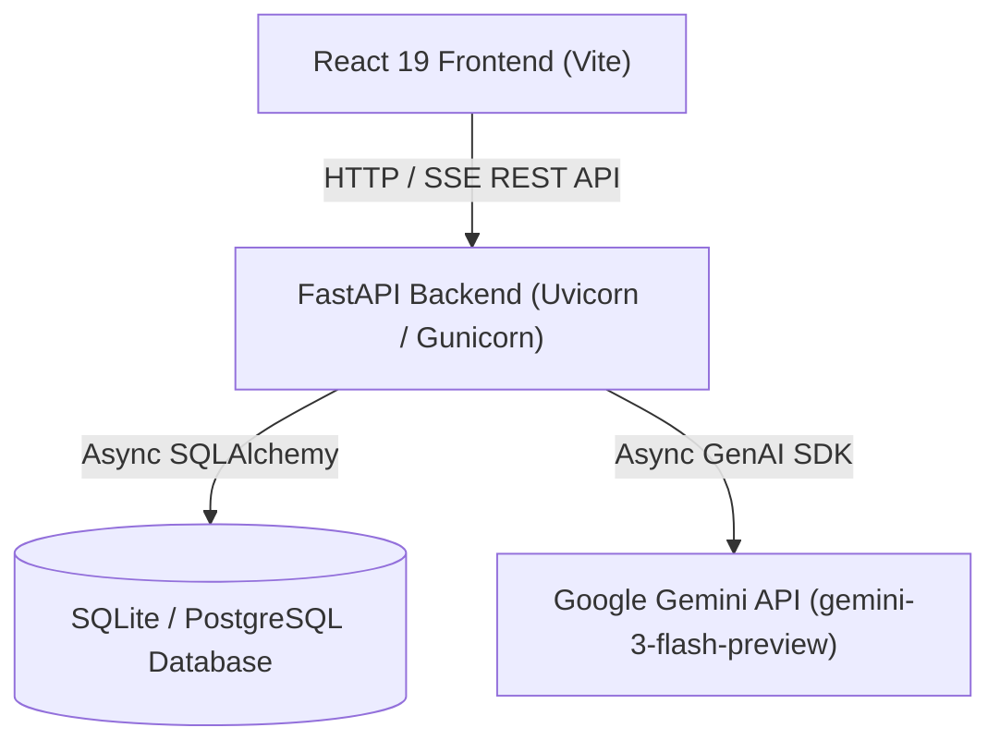

# AI Interview Preparation Chatbot

Full-stack mock technical interview web application with automated Gemini AI evaluation and session performance report generation.

<!-- NEEDS INPUT: CI status badge - No CI pipeline config found in repository -->
<!-- NEEDS INPUT: License badge - No LICENSE file present in repository -->

## Table of Contents

- [Overview](#overview)
- [Architecture](#architecture)
- [Features](#features)
- [Tech Stack](#tech-stack)
- [Prerequisites](#prerequisites)
- [Installation](#installation)
- [Configuration](#configuration)
- [Usage](#usage)
- [Project Structure](#project-structure)
- [Testing & Verification](#testing--verification)
- [Deployment](#deployment)
- [Contributing](#contributing)
- [Troubleshooting](#troubleshooting)
- [License](#license)

---

## Overview

The AI Interview Preparation Chatbot allows job candidates to practice technical interviews across different domains, languages, and difficulty levels. Candidates answer questions via text or code input, receive incremental hints, and obtain immediate score breakdowns for correctness, completeness, and clarity. At the end of each session, the application generates a comprehensive evaluation report downloadable as a PDF.

---

## Architecture



---

## Features

- **User Authentication**: Secure user registration (`/api/auth/register`) and login (`/api/auth/login`) returning JWT bearer tokens signed with HS256 (`PyJWT`, `bcrypt`).
- **Configurable Setup**: Custom interview creation by domain (e.g., Data Structures & Algorithms, DBMS), programming language, and difficulty level (Beginner, Intermediate, Advanced).
- **Interactive Code & Text Editor**: Dual input modes supporting standard text and code editing powered by Monaco Editor (`@monaco-editor/react`) and Markdown rendering (`react-markdown`).
- **Real-Time SSE Response Streaming**: Streaming response evaluation and follow-up question delivery using Server-Sent Events (`text/event-stream`).
- **Progressive Hinting System**: Up to 3 level-based hints per question with automated point deductions (`/api/session/{session_id}/hint`).
- **Time Tracking & Penalties**: Automatic scoring deductions and weakness notes for answers taking longer than 5 minutes (300 seconds).
- **Session Performance History**: History tracking (`/api/session/user/history`) with calculated average evaluation scores across answered questions.
- **Exportable PDF Reports**: Summary dashboard rendering performance breakdown (`/api/session/{session_id}/report`) with PDF export via `html2pdf.js`.
- **Mock LLM Fallback**: Automatic mock response fallback when `GEMINI_API_KEY` is not provided in environment variables.
- **API Rate Limiting**: Endpoint abuse protection configured with `slowapi` rate limiters.

---

## Tech Stack

### Backend

- **Language**: Python (`3.11.9` specified in [backend/.python-version](file:///backend/.python-version))
- **Framework**: FastAPI `>=0.110.0`
- **ASGI / Web Server**: Uvicorn `[standard]>=0.29.0`, Gunicorn `>=22.0.0`
- **Database & ORM**: SQLAlchemy `>=2.0.29` (Async), `asyncpg>=0.29.0` (PostgreSQL driver), `aiosqlite>=0.20.0` (SQLite driver)
- **AI Integration**: `google-genai>=0.3.0` (`gemini-3-flash-preview`)
- **Security & Authentication**: `PyJWT>=2.8.0`, `bcrypt>=4.1.2`
- **Utilities**: `slowapi>=0.1.9` (Rate limiting), `json-repair>=0.23.0`, `python-dotenv>=1.0.1`, `python-multipart>=0.0.9`

### Frontend

- **Language**: JavaScript (ES Modules)
- **Framework**: React `^19.2.5`, React DOM `^19.2.5`
- **Build Tool**: Vite `^8.0.10` (`@vitejs/plugin-react` `^6.0.1`)
- **Code Editor**: `@monaco-editor/react` `^4.7.0`
- **Markdown Viewer**: `react-markdown` `^10.1.0`
- **Icons**: `lucide-react` `^1.9.0`
- **HTTP Client**: Axios `^1.15.2`
- **PDF Export**: `html2pdf.js` `^0.14.0`
- **Linting**: ESLint `^10.2.1` (`@eslint/js` `^10.0.1`)

---

## Prerequisites

- **Python**: Version `3.11` or newer (Python `3.11.9` specified in [backend/.python-version](file:///backend/.python-version)).
- **Node.js**: Version `18.0` or higher (compatible with React 19 and Vite 8).
- **npm**: Node Package Manager included with Node.js.
- **Google Gemini API Key**: Optional. Set via `GEMINI_API_KEY` for live AI generation. If omitted, backend switches to built-in mock mode.

---

## Installation

### 1. Clone the repository

```bash
git clone https://github.com/Omiiii04/AI_Mini_Project.git
cd AI_Mini_Project
```

### 2. Set up the backend

```bash
cd backend
python -m venv venv
```

Activate the virtual environment:

- **Windows (PowerShell)**:
  ```powershell
  .\venv\Scripts\Activate.ps1
  ```
- **macOS / Linux**:
  ```bash
  source venv/bin/activate
  ```

Install Python dependencies:

```bash
pip install -r requirements.txt
```

> **Note**: Top-level dependencies are unpinned in [backend/requirements.in](file:///backend/requirements.in). Pinned lockfile dependencies with package hashes are maintained in [backend/requirements.txt](file:///backend/requirements.txt).

### 3. Set up the frontend

In a separate terminal window:

```bash
cd frontend
npm install
```

---

## Configuration

### Backend Environment Variables ([backend/.env.example](file:///backend/.env.example))

Copy `.env.example` to `.env` in the `backend` directory:

- **Windows (PowerShell)**:
  ```powershell
  Copy-Item .env.example .env
  ```
- **macOS / Linux**:
  ```bash
  cp .env.example .env
  ```

Configure environment variables in `backend/.env`:

| Variable | Required | Default | Description |
| :--- | :---: | :--- | :--- |
| `JWT_SECRET_KEY` | **Yes** | None | Secret key used for signing JWT bearer authentication tokens (`HS256`). App raises `ValueError` if missing. |
| `GEMINI_API_KEY` | No | None | Google Gemini API key. If omitted, LLM service falls back to generating mock questions and evaluations. |
| `DATABASE_URL` | No | `sqlite+aiosqlite:///./interview.db` | Async SQLAlchemy database URL. Accepts SQLite (`sqlite+aiosqlite://...`) or PostgreSQL (`postgresql+asyncpg://...`). Sets `ssl="require"` when non-SQLite URL is provided. |
| `ALLOWED_ORIGINS` | No | `http://localhost:80,http://localhost:5173,http://localhost:5174,http://localhost,http://127.0.0.1,http://127.0.0.1:5173,http://127.0.0.1:5174,http://127.0.0.1:80` | Comma-separated list of allowed CORS origin URLs. |

### Frontend Environment Variables ([frontend/src/services/api.js](file:///frontend/src/services/api.js#L1))

Create `frontend/.env` (optional):

| Variable | Required | Default | Description |
| :--- | :---: | :--- | :--- |
| `VITE_API_URL` | No | `http://127.0.0.1:8000` | Backend API base URL used for REST requests and Server-Sent Event streaming. |

---

## Usage

### Running the Backend Development Server

Ensure your Python virtual environment is activated, then run:

```bash
cd backend
uvicorn app.main:app --reload
```

- API Base URL: `http://127.0.0.1:8000`
- OpenAPI Documentation (Swagger UI): `http://127.0.0.1:8000/docs`
- ReDoc Documentation: `http://127.0.0.1:8000/redoc`

### Running the Frontend Development Server

In a separate terminal, start the Vite development server:

```bash
cd frontend
npm run dev
```

- Frontend Application URL: `http://localhost:5173`

### Application Workflow

1. Access the web application at `http://localhost:5173`.
2. Register a new user account or log in on the authentication screen (`/api/auth/register` or `/api/auth/login`).
3. Select an interview domain, programming language, and difficulty level to start a session (`/api/session/start`).
4. Answer technical interview questions using the text input or embedded Monaco code editor (`/api/session/chat`).
5. Request hints up to 3 times per question if needed (`/api/session/{session_id}/hint`).
6. Finish the interview session to view the performance dashboard (`/api/session/{session_id}/report`) and download the PDF report.

---

## Project Structure

```text
AI_Mini_Project/
├── backend/
│   ├── app/
│   │   ├── api/          # FastAPI authentication (/auth) and session (/session) routers and dependencies
│   │   ├── core/         # Async database configuration, JWT security, logger, and rate limiter
│   │   ├── models/       # SQLAlchemy database models (UserDB, SessionDB, MessageDB)
│   │   ├── schemas/      # Pydantic schemas for request/response validation
│   │   ├── services/     # Gemini API integration service (gemini-3-flash-preview) & mock fallbacks
│   │   └── main.py       # FastAPI application entry point, lifespan handler, CORS, and route registration
│   ├── .env.example      # Example environment variable template for backend
│   ├── .python-version   # Runtime Python version specification (3.11.9)
│   ├── requirements.in   # Top-level dependency requirements
│   └── requirements.txt  # Pinned dependency lockfile with hashes
├── frontend/
│   ├── public/           # Static public assets
│   ├── src/
│   │   ├── components/   # UI view components (chat, layout, setup, summary)
│   │   ├── hooks/        # State management and SSE event streaming hook (useInterview.js)
│   │   ├── services/     # Fetch API wrapper and endpoint definitions (api.js)
│   │   ├── styles/       # CSS styling sheets
│   │   ├── App.jsx       # Main application layout and state router
│   │   └── main.jsx      # React DOM entry point
│   ├── eslint.config.js  # ESLint configuration
│   ├── index.html        # Main HTML document template
│   ├── package.json      # Frontend package definitions and scripts
│   ├── package-lock.json # Locked frontend dependency tree
│   └── vite.config.js    # Vite configuration with React plugin
└── README.md
```

---

## Testing & Verification

> **Note**: Terminal command execution was verified statically against repository manifests and configuration files.

### Frontend Verification

- **Linting**:
  ```bash
  cd frontend
  npm run lint
  ```
- **Production Build Verification**:
  ```bash
  cd frontend
  npm run build
  ```

### Backend Verification

- **Module Import Verification**:
  ```bash
  cd backend
  python -c "import app.main; print('Backend module loaded successfully')"
  ```

---

## Deployment

### Backend Production Deployment

Run the ASGI application using Gunicorn with Uvicorn workers:

```bash
cd backend
gunicorn app.main:app -w 4 -k uvicorn.workers.UvicornWorker -b 0.0.0.0:8000
```

> **Database SSL Notice**: When `DATABASE_URL` is set to a non-SQLite database (e.g., PostgreSQL on Render), connection settings automatically enforce `ssl="require"` ([backend/app/core/db.py](file:///backend/app/core/db.py#L16)).

### Frontend Production Deployment

Compile production static assets:

```bash
cd frontend
npm run build
```

The production bundle is generated in `frontend/dist/` for deployment on static web servers or Nginx.

---

## Contributing

Ensure all proposed changes adhere to the codebase standards:

1. Validate frontend code formatting using `npm run lint`.
2. Ensure backend code imports without errors and all required environment variables in `backend/.env` are present.

---

## Troubleshooting

- **Backend fails to start with `ValueError: JWT_SECRET_KEY environment variable is missing`**:
  Ensure you have created `backend/.env` from `backend/.env.example` and set a non-empty `JWT_SECRET_KEY`.
- **Backend operates in Mock AI Mode**:
  If `GEMINI_API_KEY` is not defined in `backend/.env`, the system defaults to pre-defined mock questions and evaluations. Set a valid `GEMINI_API_KEY` to enable live Gemini LLM generation.
- **CORS error from frontend to backend**:
  Verify `ALLOWED_ORIGINS` in `backend/.env` includes your frontend URL (default includes `http://localhost:5173` and `http://127.0.0.1:5173`).

---

## License

<!-- NEEDS INPUT: License type and explicit LICENSE file missing in repository -->
This project does not contain an explicit `LICENSE` file in the repository. All rights reserved by the repository owner.
